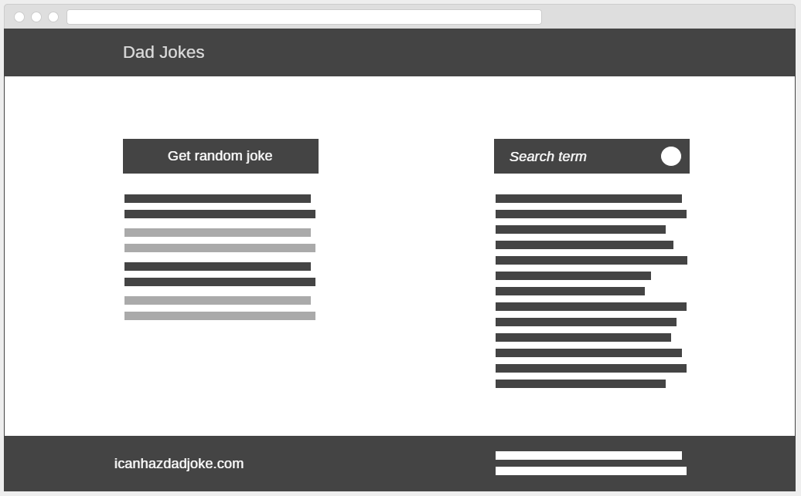

# Dad Jokes
Inlämningsuppgift 1 i Webbutveckling 3.

## Introduktion
I denna obligatoriska, individuella inlämningsuppgift skall du implementera en liten tjänst som hämtar data via nätet. Vi har i kursen pratat om att många APIer är låsta för AJAX-anrop på grund av *same-origin policy*. Ett undantag var GitHubs API (som vi genomförde övningsuppgiften på) och ett annat finns på [icanhazdadjoke.com](https://icanhazdadjoke.com) som vi ska använda för den här uppgiften. Det är en enkel *"tjänst"* som tillhandahåller så kallade *dad jokes*. Dessa skämt ska kunna hämtas och sökas upp på den sida du skapar och presenteras på något trevligt sätt.

Utöver generella kunskaper om Webbutveckling kommer du att behöva använda dig av kunskaper om bland annat:

* JavaScript, händelsehantering & DOM
* JSON
* AJAX

Det är tillåtet att använda sig av [jQuery](https://jquery.com), [Bootstrap](https://getbootstrap.com/docs/3.3/) eller liknande bibliotek.

## Att göra
Denna gång får du inte någon given kod utan skapar allt på egen hand. Det ingår även att sätta sig in i hur just detta API fungerar och vilka önskemål/krav dess utvecklare ställer på dig som användare. Det som skall implementeras är följande:

* En komplett webbsida med så tilltalande design som möjligt.
* Webbsidans funktionalitet eller utseende skall ej begränsas om man använder en mindre skärm (mobil enhet).
* Möjlighet att hämta en slumpat skämt och presentera i någon form av lista.
* Möjlighet att söka på skämt och få resultaten presenterade på lämpligt vis.
* Möjlighet att visa ett skämt som en bild.

För att få en idé om hur det kan se ut så kan man ha följande [wireframe](https://en.wikipedia.org/wiki/Website_wireframe) i åtanke. Det är dock fullt möjligt att göra avsteg från denna.

## Bedömning
Din inskickade uppgift kommer att bedömas med poäng på E-, C- och A-nivå enligt följande matris.

Område | E | C | A |
------ | - | - | - |
Design | Webbsidan har en grundstruktur som liknar bifogad wireframe och går att använda även med en liten skärm. (2p) | Designen är tilltalande, färger harmonierar med varandra och knappar, sökfält mm. har annat än standardutseende. (2p) | Bonus: Om du implementerar några diskreta animeringar för att ytterligare göra sidan mer iögonfallande kan du erhålla bonus-poäng.
AJAX | Data hämtas i JSON-format med AJAX-anrop. (2p) | Någon form av felhantering är på plats och header-fältet `User-Agent` hanteras korrekt enligt API-beskrivningen. (2p) | Felhantering och nullvärdeshantering är på plats. (2p)
JSON | JSON hanteras på ett korrekt sätt. (1p) |  |
Presentation | Datan visas i webbläsaren med någon lista. (1p) | Varannat inlägg i listan har olika färg för att tydligare separera skämten från varandra. (1p) | Någon form av *"Laddar..."*-meddelande är implementerat korrekt. (1p) Senaste fem sökningarna sparas i `localStorage` och visas under sökrutan där de är länkade så att sökningen kan göras om med ett klick. (2p)
Validering | HTML, CSS validerar, JavaScript genererar inga fel och inga spårutskrifter finns kvar. (1p) | |
Kodkvalitet | Koden har godtagbar struktur och namngivningen är lämplig (på engelska). En kommentar till varje funktion finns (på engelska). Onödig kod är minimerad. (3p) | Koden har tydlig struktur och är konsekvent formaterad (2p) | Koden är väl indelad i funktioner och ingen upprepning av kodstycken sker. (1p)
*Pull request*-kommentar | Implementationen är kort kommenterad (1p) | Några brister / svagheter / utvecklingsområden har identifierats (1p) | Förbättringsförslag och/eller alternativa lösningar presenteras. (2p)

### Gränser
* Max: 27p (11/8/8)
* E: Totalt 10p.
* C: Totalt 15p varav 5 på C-nivå eller högre.
* A: Totalt 20p varav 5 på C-nivå och 5 på A-nivå.

För varje 24-timmarsperiod som din inlämning blir försenad kommer ett poäng att dras bort, med start på högsta nivån. Det första poänget dras direkt efter deadline.

## *Får man hjälpa varandra?*
Ja och nej. Ni får diskutera uppgiften som sådan och lösningsförslag på en konceptuell nivå men inte koddetaljer. Exempelvis är det ok att tipsa grannen om *Jag löste det genom att vandra igenom hela listan av bilder* men inte att berätta rad för rad vilken kod man skrev, dvs. försök kommunicera med begrepp snarare än med kod.

## Fusk
Givetvis är det inte ok att kopiera kod från sina kamrater eller internet. Om man hittar större lösningar när man googlar på något problem och i efterhand tycker att det är svårt att göra en lösning som inte liknar den man redan sett så lämnar man en referens till webbsidan i en `/* kommentar */` i sitt skript. Om det blir väldigt många sådana kommentarer i en inlämning kan man bli ombedd att förklara sin lösning muntligt efter deadline som en extra kontroll. En rik commit-historik brukar vara ett gott tecken på att man gjort sin lösning själv!

## Referensmaterial

* [Eloquent JavaScript](http://eloquentjavascript.net/)
* [Codecademy: Introduction to JavaScript](https://www.codecademy.com/learn/introduction-to-javascript)
* [Codecademy: Make a Website](https://www.codecademy.com/learn/make-a-website)
* [W3Schools: JavaScript Reference](https://www.w3schools.com/jsref/default.asp)
* [MDN: JavaScript Reference](https://developer.mozilla.org/docs/Web/JavaScript/Reference)
* [Repo: GitHub Profile](https://github.com/t4ed/web3-github-profile)
* [Bootstrap](https://getbootstrap.com/docs/3.3)
* [icanhazdadjoke API](https://icanhazdadjoke.com/api)

## Inlämning & deadline
Inlämning sker genom att skapa en *pull request* efter att ha commitat och pushat allt sitt arbete till GitHub. I *pull requesten* bifogar du två korta kommentarer. En om vilka funktioner du implementerat (dvs. vad är klart) och en om vilka svagheter/brister din lösning har samt förbättringsförslag till dessa (om du har några).

Deadline är onsdag 18/10 kl. 23:59.

Lycka till!
